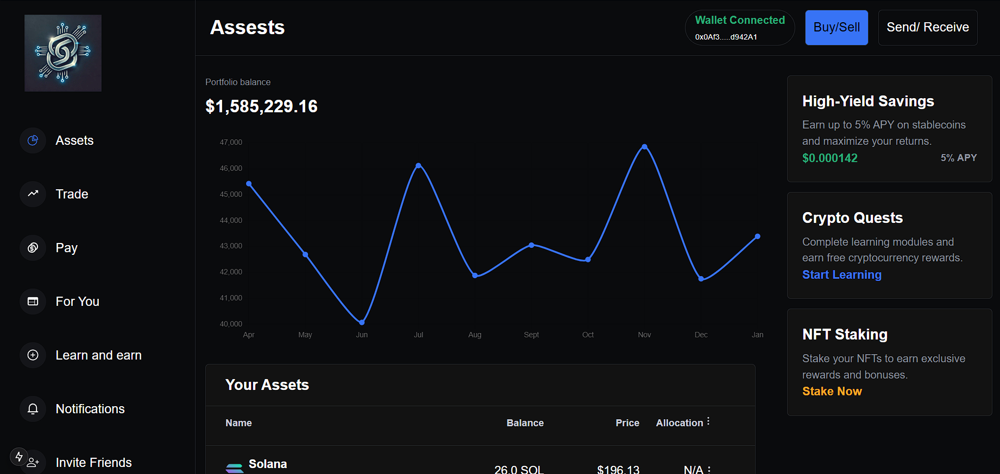
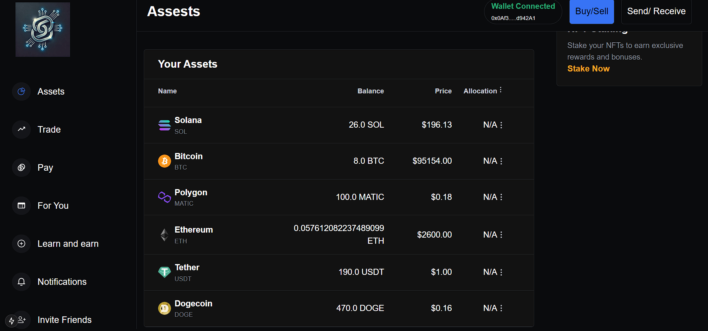
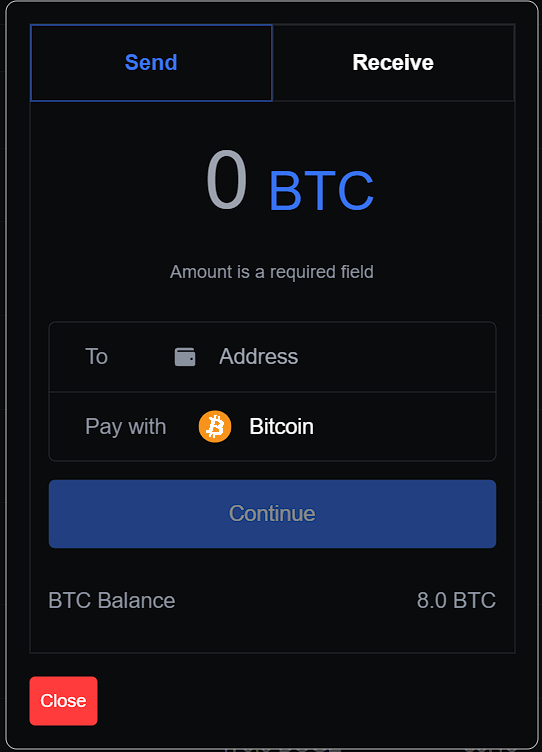

# 🚀 NexaChain - Decentralized Crypto Exchange



**NexaChain** is a decentralized exchange (DEX) platform for buying, selling, and storing cryptocurrencies. Built using **Next.js**, **Thirdweb**, and **Sanity.io**, it enables seamless interaction with ERC20 tokens on the **Sepolia Testnet** via **MetaMask**.

---

## ⚙️ Tech Stack

- **Frontend:** Next.js 13+ (App Router)
- **Blockchain SDK:** Thirdweb
- **Wallet Integration:** MetaMask
- **Database & CMS:** Sanity.io
- **Styling:** styled-components
- **Deployment:** Vercel

---

## 🌟 Features

- 🔐 Connect Wallet using MetaMask
- 🪙 Buy, Send, and Receive ERC20 Tokens
- 💹 Real-time Token Balances in USD
- 🧾 Token Metadata fetched from Sanity
- 📊 Portfolio Dashboard with Pie Charts
- ⚡ Live blockchain interactions via Thirdweb SDK
- 🧪 Built and tested on Sepolia Testnet

---

## 📸 Screenshots

| Portfolio View | Send Token Modal |
|----------------|-----------------|
|  |  |

---

## 🚀 Getting Started

Clone the repo and install dependencies:

```
git clone https://github.com/dot-D69/nexachain.git
cd nexachain
npm install

``` 

Start the development server:

```
npm run dev

Open http://localhost:3000 in your browser.
```

🧾 Setup Requirements
✅ MetaMask Extension Installed

🌐 Connected to Sepolia Testnet

🪙 Tokens created using Thirdweb

📦 Optional: Sanity Project for Token Metadata (fork mine if needed)


📂 Project Structure

```
nexachain/
│
├── app/                   # App Router pages
├── components/            # UI Components
├── lib/                   # Utility functions
├── public/                # Static files and screenshots
├── styles/                # Global CSS / styled-components
└── sanity/                # (Optional) Sanity schemas

```

⭐️ Show Some Criticism
If you find anything worth improving, please do:

🗣 Share feedback

🔁 Fork and extend it!
